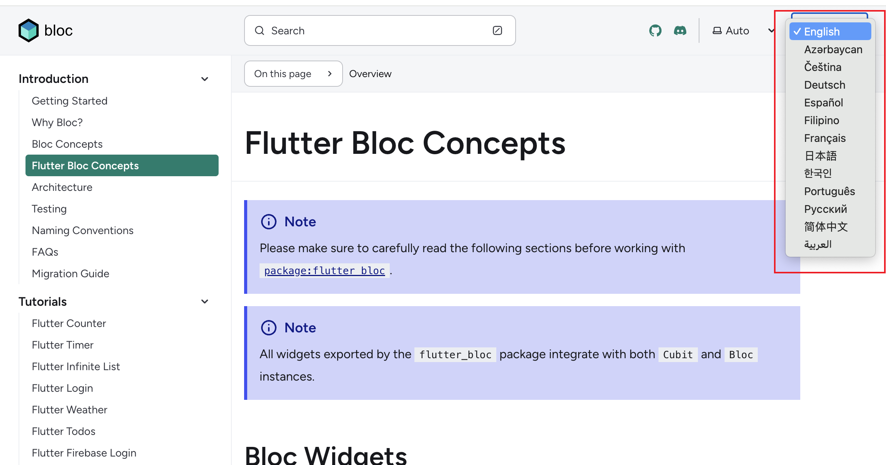
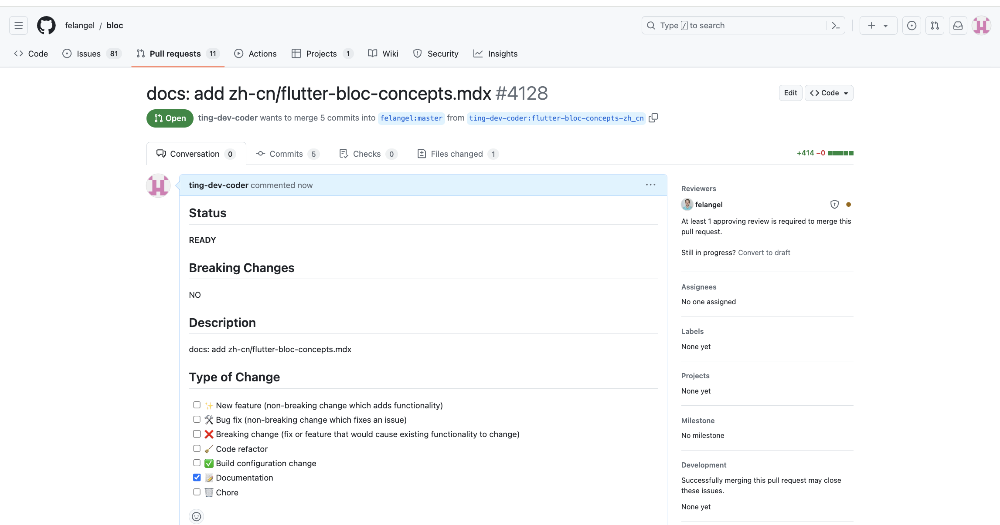

# Project: Flutter Bloc

## **Description:** 

Bloc is a state management library for Flutter that helps developers manage the state of their applications in a predictable and efficient manner.Bloc's components communicate with the UI layer through streams, allowing for reactive updates to the user interface based on changes in application state. Bloc simplifies the process of managing complex stateful logic and promotes a clean and modular code structure in Flutter applications.

## **Forked URL:** 

https://github.com/ting-dev-coder/bloc

## **Contributed:** 

In the offcial bloc document website, they provie mutiple langaugse for each pages. However

This community is almost perfect. However, the official website provides translation features, but none of them are available.

## **Reflection:**

I chose **Dart** as my Community Code project language. I have 3 years of experience with Javascript, but it has mostly been limited to web development within browsers (although we can use Electron for desktop applications). Last year, I decided to expand my skills and explore a mobile language. I did consider native mobile languages such as Swift. However, I view mobile development as a secondary skill, so a native language would require too much effort than I expected. Initially, I learned React Native since it is based on Javascript. Later, I encountered some issues that the community had no plans to fix. Meanwhile, I discovered Flutter, created by Google. I found its coding approach interesting, and it is supported by many libraries.

I am a newbie in Flutter. Although I have some basic coding experience, Bloc is very different from the state management I'm used to. Initially, I wondered what all the API lists were.

Afterward, I found they provide a page to intrduce all methods.Although the offical document almost are well-complete, this concept for a beginner like me, it would be better using native langague to learn at first place as it could be comlicated or somthing totally new for a begeinner .Additonally,not every learners here have same foundation so they might misuse the widgets / methods.Afterward,when I become more comfortable with the field , I can switch back to learn in English.

There is a page about [Flutter Bloc Concepts](https://bloclibrary.dev/flutter-bloc-concepts) that lists all the methods, and I think this will be the page I would like to work on for translation.

I didn't actually translate the sections of the document in the same order as they appear, since the way I organized them is different. So, I tried to break these sections down from outer to inner, like an onion! I started with the methods required at the beginning, such as Providers (BlocProvider, MultiBlocProvider). If the next section wasn't called inside the previously introduced method, I skipped to the next until I could understand and see the whole creation process.

During the process, one of the issues I encountered was how to translate a specific word that seems ordinary but becomes peculiar after translation, such as the word 'widget'. At certain stages, translations also need to utilize concise language while ensuring detailed wording. Ultimately, I decided not to translate these academic words but to keep them displayed in English.

In summary, I enjoyed the translation process because it is the library I am learning, but I still struggle with it. Throughout the process, I find myself needing to carefully read the documents and truly understand their meanings, which enhances my impression of their usage while translating.

## Detailed discussion of code review and outcomes:

I conducted a review with **Ravinder Singh**. Initially, he assumed that the translation might involve some coding approach. Fortunately, in this repository, contributors only need to replace words without updating any code. It's not surprising that people think this way because that's what I , in first place, thought as well, but eventually realized that everyone could contribute without providing any code! 

## **Next step:** 

I might consider to really push request for this contribution.

***Updated on Mar 25***

I actualy create a issue to require if my tranlation is acceptable as it only involved one page.

​	***Updated on Mar 26***

​	I created a PR , and waiting for a review

