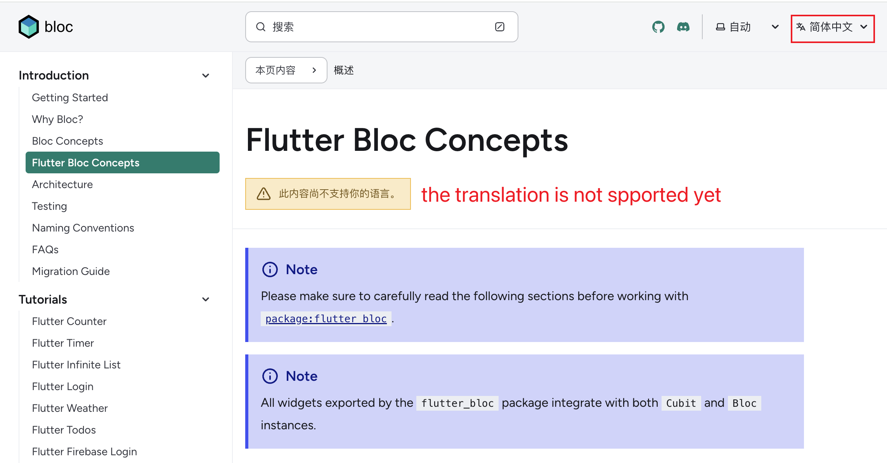

# Project: Flutter Bloc

**Description:** 

Bloc is a state management library for Flutter that helps developers manage the state of their applications in a predictable and efficient manner.Bloc's components communicate with the UI layer through streams, allowing for reactive updates to the user interface based on changes in application state. Bloc simplifies the process of managing complex stateful logic and promotes a clean and modular code structure in Flutter applications.

**Forked URL:** 

https://github.com/ting-dev-coder/bloc

**Contributed:** 

In the offcial bloc document website, they provie mutiple langaugse for each pages. However

This community is almost perfect. However, the official website provides translation features, but none of them are available.

**Reflection:**

I am a newbie in flutter. Although I have some basic coding experience , bloc is way different from state magement I used. At first palce, I wondering what's there all api list

I chose **Dart** as my Community Code project language. I have 3 years of experience with Javascript, but it has mostly been limited to web development within browsers (although we can use Electron for desktop applications). Last year, I decided to expand my skills and explore a mobile language. I did consider native mobile languages such as Swift. However, I view mobile development as a secondary skill, so a native language would require too much effort than I expected. Initially, I learned React Native since it is based on Javascript. Later, I encountered some issues that the community had no plans to fix. Meanwhile, I discovered Flutter, created by Google. I found its coding approach interesting, and it is supported by many libraries.
Learning how to use global state management is essential for me when starting a new language. I would like to use these translations to learn essential Bloc APIs. There is a page about [Flutter Bloc Concepts](https://bloclibrary.dev/flutter-bloc-concepts) that lists all the APIs, and I think this will be the page I would like to work on for translation.

At week 10 I was working on `BlocBuilder` and  `BlocProvider` sections.

**Next step:** 

I might consider to really push request for this contribution.

