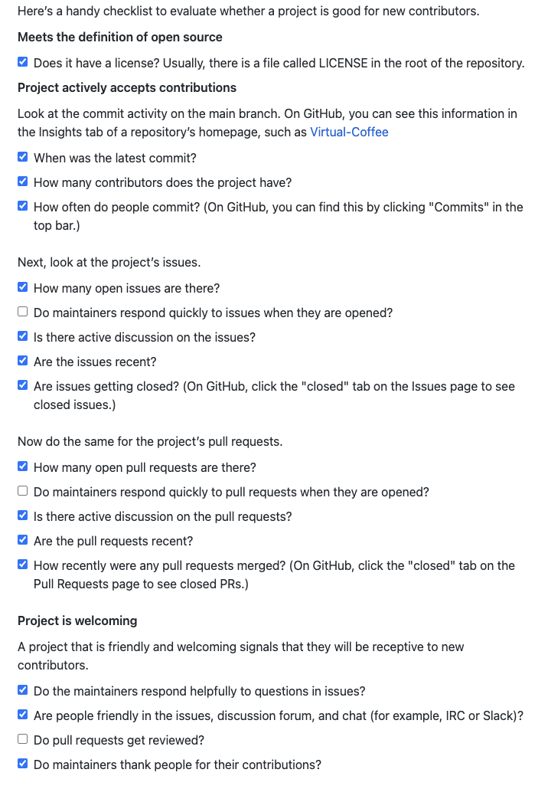
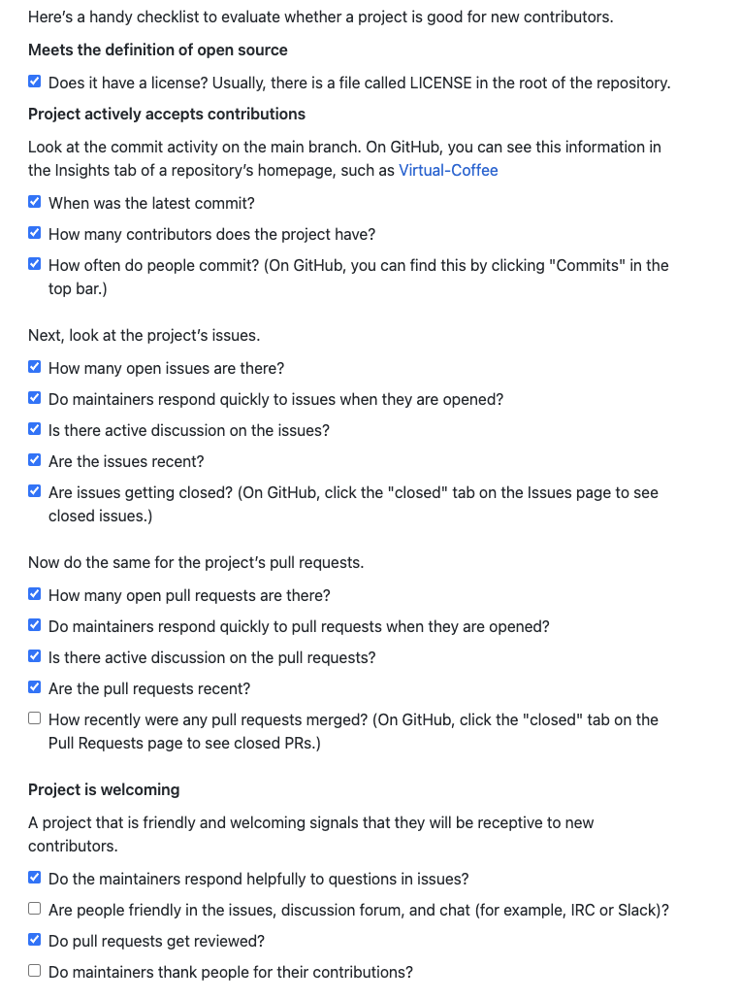
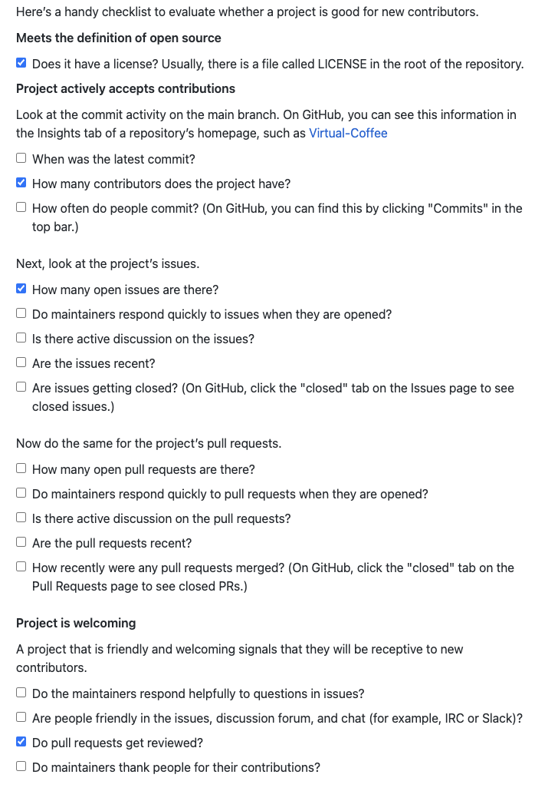
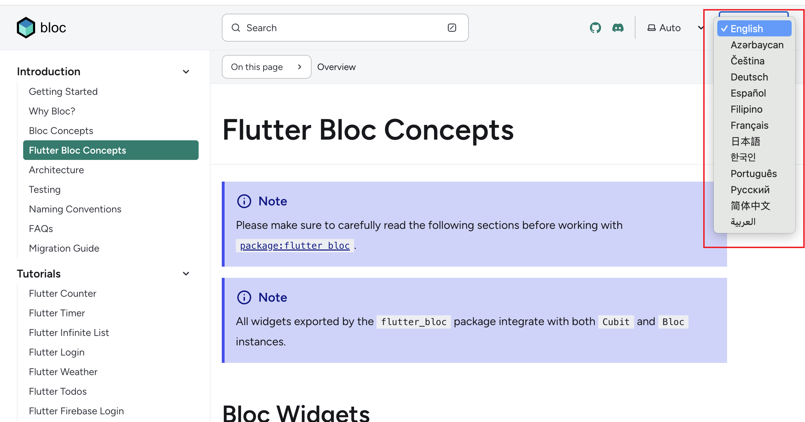
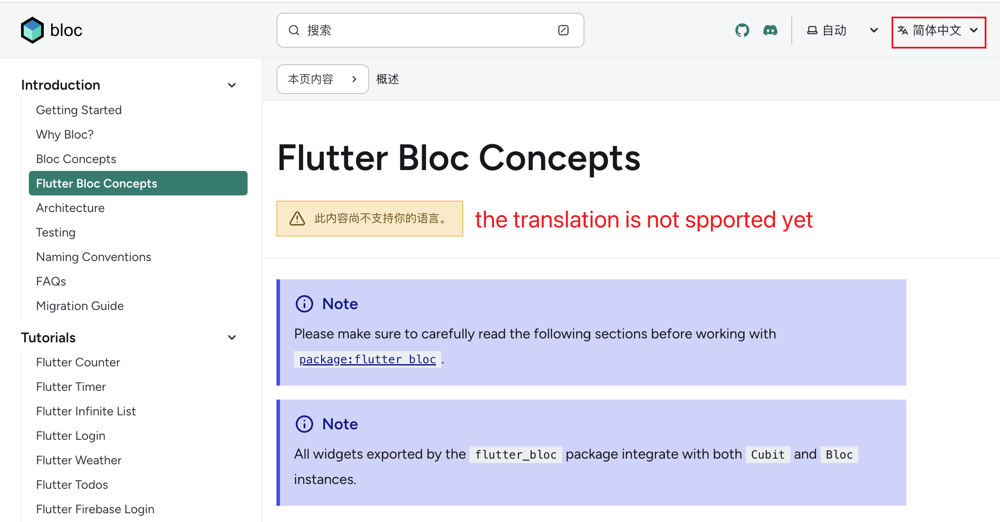
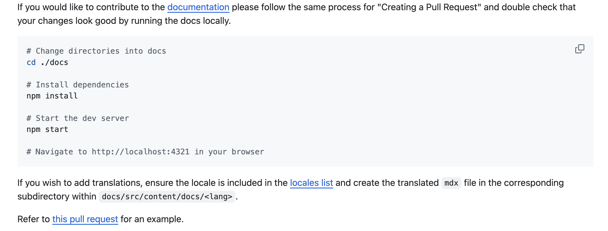

# Research and Reflection Journal

## Week 8

### Activities:

#### RESEARCH A NEW LANGUAGE

Learn more about  programming languages -  [Lua](https://www.lua.org/)

- **What is the language used for?**

  Lua is an embeddable, extensible, lightweight language.Lua has a small and clean API, making it suitable for various applications, particularly those where a small and efficient scripting language is needed.

  It is a  general-purpose programming. Lua has implemented  for games , embedded systems and scripting environments.

- **Who uses the language?**

  - Scripting Environments

    Common usage is combine Nigx with Lua.Lua is utilized as a scripting language within the nginx environment to provide flexibility and extensibility in configuring and customizing the behavior of the web server such as Logical Processing and Log Control

  - Game Developers

    developers can create games by Lua.There are some famous examples such as Angry Birds which is mostly written in Lua and the mobile payment app -Venmo was built using Lua.

  - Software Developers

    Developers can use Lua to make code commucicate with GPIO.

- **What are some useful resources?**

- [Official Lua Website](https://www.lua.org/)

-  [Youtube - IOT with Lua](https://www.youtube.com/results?search_query=IOT+with+Lua)

- **Why are these specific resources useful?**

  1. [Official Lua Website](https://www.lua.org/)
     As a benginer offical website always has a good tortual to explain what is it about, and demstorate basic exampes
  2.  [Youtube - IOT with Lua](https://www.youtube.com/results?search_query=IOT+with+Lua) 
      When it comes to devices, situation become complex and it is hard to understand just by wordings.Thereby, programming for ITO purpose while watching a viedo step by step will make process efficient.

**Reflection:**

I have learned that it's possible to combine different languages for a project. I have experience with Raspberry Pi, where I coded to communicate with various devices like GPIO and a buzzer Back then, I had to use a substantial amount of code and might end up discovering that the device was not functioning.  Another significant takeaway is that in such cases, Lua proves to be a suitable language for quickly implementing requirements. For example, if we design a light bulb for a device and want to check if the bulb is working or not, Lua is an easy language to use for testing purposes.

#### CHOOSE A LANGUAGE FOR COMMUNITY CODE

I chose **[Dart](https://dart.dev/)** as my Community Code project language. I have 3 years of experience with Javascript, but it has mostly been limited to web development within browsers (although we can use Electron for desktop applications). Last year, I decided to expand my skills and explore a mobile language. I did consider native mobile languages such as Swift. However, I view mobile development as a secondary skill, so a native language would require too much effort than I expected. Initially, I learned React Native since it is based on Javascript. Later, I encountered some issues that the community had no plans to fix. Meanwhile, I discovered Flutter, created by Google. I found its coding approach interesting, and it is supported by many libraries. In a nutshell, I chose Dart for my assignment. Although I am still torn between Flutter and React Native, I can use this assignment to delve into Dart.

## Week 9

### Activities:

1. #### **READ “HOW TO CONTRIBUTE TO OPEN SOURCE”**

I used to search for issues for solutions and somtime comments under a issue to ask for help. I feel like someone being contributed to a project must be a expert, whcih I am still far away there. After reading this guide, I reilize that a densiner , a writer  and even a translator can also get involed with a project  and be part of members.Moreover, open source can also be a book and a recipe. What a fresh idea!

I choose Dart as I research langauge, and I am nearly newbie.Therefore finding issue or fix issue would be a tough chanellge for me. Hence I would like to fcus on document  or translation part, and standing on a shoe of a beginner , seeing what some information could be helpful.

- **FIND POTENTIAL PROJECTS TO CONTRIBUTE TO**

1. [bloc](https://github.com/felangel/bloc)
   It is definitely a plugin I would love to use for a Flutter project. The community is strong, and there are also translations available. 

   

2. [fl_chart](https://github.com/imaNNeo/fl_chart)

    I have been used [Apache ECharts](https://echarts.apache.org/) to deal with most of chart tasks on website. It works really well, and it provide many customized features. On the mobile side,  I am also wondering any customized charts available. Here is the libray I found most popular. However they don't support enough chart type , for example : gauge. Although I saw a issue with a request feature label about that but the issue has been opened sinc 2020.

   

3. [easy_localization](https://github.com/aissat/easy_localization)

   Support mutiple lanagues could be a easy task , as long as the libray is easy to use. So I am also look for a libriary that supports localization langaue. I found this libray although the starts is not much as popular one but their disccusion is active, and have some closed pull request few weeks ago.

4. [flutter_carousel_slider](https://github.com/serenader2014/flutter_carousel_slider)

   To be a attractive application, slider is good choose to go for. I also found a popular slider libiray. However, this project seems not have active disscuion and the latest closed commit is at Jul 2, 2023.

   

- **IDENTIFY ISSUES TO SUPPORT**

  - bloc

    The documentation provided by the community for the Bloc is comprehensive. However, despite the presence of translation buttons on the official website, many translations remain unavailable.

    **Where I would start:** 
  
    I would like to use this translations to learn essienal  bloc api. There is page about [Flutter Bloc Concepts](https://bloclibrary.dev/flutter-bloc-concepts) where lists all api, and I think this will be the page I would like to work on for translation.
  
  - fl_chart
  
    URL: https://github.com/imaNNeo/fl_chart/issues/1279
  
    **Description of the issue:**
  
    This feature request is about the ability to dynamically change the `tooltipBgColor` , customized the background color of tooltips based on the `y` value of the line in the chart such as a black background for points below 0 and a white background for points above 0. 
  
  - easy_localization
  
    I havn't acually really use this library, so document or fix bug colud cause too have loading for me.Maybe I could fcous on translation for their READM.md.
  
    

##### Reflection:

This week I try to get involve to be a contributor for a project. Significant takeaway here is I think I am getting into the flow different people contribute to a project. It is total refresh and cool for me.

#### Personal contributions on  [pattern library repository](https://github.com/nic-dgl104-winter-2024/pattern-library)

- [Add skeleton outline to README.md](https://github.com/nic-dgl104-winter-2024/pattern-library/issues/16) 
- [Add JavaScript implementation for Singleton pattern](https://github.com/nic-dgl104-winter-2024/pattern-library/issues/2)

##### Reflection:

I was not familiar with the actual workflow for contributions, but now I am getting used to it. Most of the time, I spend my time understanding the structure, and sometimes communication can take up half of the processing time to ensure everyone is on the same page.

After grasping the entire process, I started to learn the singleton pattern. Although I had learned this pattern before, I used this opportunity to review it. Initially, I preferred understanding the conditions under which I could use this pattern rather than focusing on how to write it. Since the reason I learn these patterns is to make my project more well-organized, there is no point in understanding a pattern without knowing how to use it. For this coding task, the first step is to analyze the real conditions under which I can implement the singleton pattern. The second step is to learn how to write the pattern, and finally, to implement the pattern in a real case.

## Week 10

### CONTRIBUTE TO EXTERNAL COMMUNITY

This week, I decided to work on Bloc for my contribution. It was an interesting process, especially when I initially felt like there was nothing I could do for this community. It felt perfect. Afterwards, I checked the issues labeled as documentation and reviewed what they were all about. I browsed the official website and discovered that even though they provide translations, none of them are available. Obviously, this is where I could make my contribution!

After making this decision, I opened their [CONTRIBUTING.md](https://github.com/felangel/bloc/blob/master/CONTRIBUTING.md), where I found instructions for contributing translations.

Since there are no translations available there,it still took me some time to get the translations running locally.  This is the first time I realized that official documents are maintained together with the source code. I thought they would be written and maintained separately from the code. I also explored their file structure; different projects involve different people creating their own file structures. Hence, this is why CONTRIBUTING.md is so important for a community

### Personal contributions on  [pattern library repository](https://github.com/nic-dgl104-winter-2024/pattern-library)

- [Create an appropriate folder structure in the repository](https://github.com/nic-dgl104-winter-2024/pattern-library/issues/1)
- [Add Lua implementation for Singleton pattern](https://github.com/nic-dgl104-winter-2024/pattern-library/issues/12)

**Reflections**

After I am similair with sigletion pattern by writing Singleton pattern in Javascript, I think I could practice more for this pattern and then I choose Lua to practice. The concept also is identical, but I need to learn base syntax of Lua. Interesting for me is Lua is not required any bracket and the whole code become neat, but I wonder would it be still this neat if writng thoudhound code.

## Week 11

### Personal contributions on [pattern library repository](https://github.com/nic-dgl104-winter-2024/pattern-library)

- [Add implementation / description of model view viewmodel (MVVM)](https://github.com/nic-dgl104-winter-2024/pattern-library/issues/15) 
- [Add Dart implementation for Observer pattern](https://github.com/nic-dgl104-winter-2024/pattern-library/issues/7)

The concept of observer is straightforward, but I am still learning dart so I spend most of time on how to make the data strict , or should I create jsut enum or implicaion interface (class)

I've been using Vue.js as my front-end framework for three years. I learned its source code by writing code fragments while following tutorial videos. Implementing MVVM this time provides me with an opportunity to summarize and review Vue's core concepts. Although I rarely use methods like `new Proxy` and `Reflect` in my daily practice, having a better understanding of their basic usage makes it easier to come up with solutions.

### CONTINUE CONTRIBUTIONS TO EXTERNAL COMMUNITY

This week, I started working on translating the RepositoryProvider sections. When I was learning this section, the concept of a repository seemed quite vague to me. In the web field, we often just use the term 'API' to refer to requesting data. However, in this field, I spent some time figuring out the differences between a service and a repository.

Based on my learning knowledge, I differentiate them as follows: a service usually involves backend requests, while a repository typically handles data access and persistence. It could manage local data or even handle data received from a service.

### FOLLOW-UP QUESTIONS AND REFLECTIONS

The langauge I choose is Dart. Although it is not on the list of [multi-paradigmatic programming languages](https://en.wikipedia.org/wiki/Comparison_of_multi-paradigm_programming_languages), it is OOP capable.

It supports OOP to the following extents

**Classes and Objects**: Dart allows you to define classes and create objects based on those classes. Classes can have properties (fields) and methods.

**Inheritance**: Dart supports single inheritance, meaning a class can inherit from only one superclass. Moreover, Dart also supports mixins, which allow classes to reuse code from multiple sources.

**Abstraction**: Dart supports abstraction, allowing you to define abstract classes and methods that provide a blueprint for other classes to implement.

## Week 12

#to be done

# Reference

[1] Cory Stieg (2022 11 06). Why Lua Is So Popular — & What You Can Build With It. Codecademy https://www.codecademy.com/resources/blog/what-is-lua-programming-language-used-for/